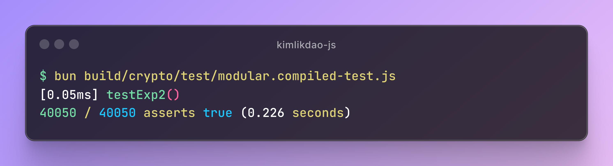
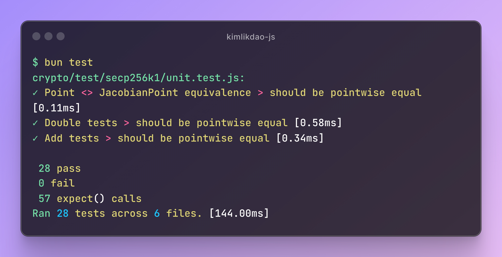

<h1> kimlikdao-js</a></h1>

[](https://github.com/KimlikDAO/kimlikdao-js/actions/workflows/test.yml)
[](https://www.npmjs.com/package/@kimlikdao/lib)
[](https://opensource.org/licenses/MIT)
[](https://kimlikdao.org)

kimlikdao-js is a repository containing JavaScript modules essential for KimlikDAO projects.

# 🗂️ Features

## Highlights

🗝️ [`crypto`](./crypto): Cryptographic functions and libraries

  - `arfCurve`: An efficient Arf Curve ($y^2 = x^3 + b$) class factory
  - `wesolowski`: Our Wesolowski VDF implementation

🪁 [`kastro`](./kastro): Our compile-time focused web-framework

  - Our custom web framework for building hyper-efficient web apps

⚙️ [`kdjs`](./kdjs): KimlikDAO JavaScript compiler

🪪 [`did`](./did): Definitions of DID and KPass by KimlikDAO

## Other goodies

🔌 `api`: Definitions of standard protocols (e.g., jsonrpc, oauth2)

🧬 `crosschain`: Definitions and structures valid across all blockchains

💎 `ethereum`: Tools for interacting with Ethereum nodes

🪶 `mina`: Tools for working Mina dApps and Mina nodes.

📡 `node`: Definitions needed when communicating with KimlikDAO protocol nodes

🧪 `testing`: Libraries for writing tests

🧰 `util`: Conversion tools and external definitions

# 👩‍💻 Development

```shell
git clone https://github.com/KimlikDAO/kimlikdao-js
cd kimlikdao-js
bun i
```

These commands will clone the repository into your local development
environment and download the packages necessary for the repository to function.
If you don't already have bun installed, you can install it by following the
[official guide](https://bun.sh/docs/installation).

# 🧪 Tests

The tests can be run in two different modes:

- Uncompiled:
  We use `bun`'s test runner, which has a jest-like interface.
  ```shell
  bun test
  ```
- Compiled (using `kdjs`):
  We also run the same tests after compiling them with `kdjs` first:
  ```shell
  bun run test
  ```
  Note that `kdjs` makes aggressive optimizations using the provided
  type information. It is crucial to run the tests in compiled mode
  since incorrect type annotations will lead to functionally incorrect
  output.

To run tests in a specific directory, say `crypto`, you can also do
```shell
bun test crypto # uncompiled
bun run test crypto # compiled
```

# ⏱️ Benchmarks

You can run a benchmark either directly as a regular es6 module
```shell
bun run crypto/bench/arfCurve.bench.js
```
or compile all of them and benchmark the compiled modules:
```shell
bun run bench
```

When run, output will look like this:




